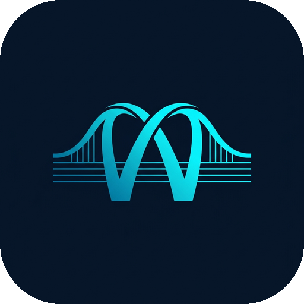

<div align="center">



# WealthBridge
### *Bridging Today's Income with Tomorrow's Retirement*

[](https://python.org)
[](https://fastapi.tiangolo.com)
[](https://chartjs.org)
[](https://vercel.com)
[](https://web.dev/progressive-web-apps/)
[](LICENSE)

**A premium, interactive retirement corpus planning dashboard for Indian professionals — powered by actuarial-grade financial modelling, Monte Carlo stochastic simulation, and a blazing-fast, installable web application.**

[🔮 Live Demo](#-deployment) · [📐 Architecture](#-architecture) · [📊 Features](#-features) · [🛠️ Tech Stack](#-tech-stack) · [🚀 Quick Start](#-quick-start) · [👥 Contributors](#-contributors)

</div>

---

## 📖 What Is WealthBridge?

WealthBridge is an **end-to-end retirement financial planning platform** designed specifically for Indian professionals navigating the complex landscape of salary growth, inflation, mandatory provident contributions, and defined-benefit pension schemes.

### 🎯 The Problem It Solves

Most Indian professionals have retirement savings distributed across **four distinct, incompatible vehicles**:

| Vehicle | Nature | Typical Awareness |
|---|---|---|
| **EPF** (Employees' Provident Fund) | Mandatory, employer-matched, guaranteed | High |
| **NPS** (National Pension System) | Voluntary + employer-matched, market-linked | Medium |
| **ELSS** (Equity Linked Savings Scheme) | Market-linked SIP, tax-saving | Low |
| **WeCare DB Pension** | Employer-sponsored defined-benefit plan | Very Low |

These tools **never talk to each other**. An employee has no unified view of:
- What their **total retirement corpus** will be at age 60
- How much **monthly income** they can sustainably draw in retirement
- Whether their projected corpus **survives their lifetime** (longevity risk)
- How different **salary growth scenarios** alter their retirement outcome

**WealthBridge solves this** by integrating all four vehicles into a single actuarial engine, running 2,000-iteration Monte Carlo simulations, and presenting it through an interactive dashboard that lets you see the impact of every assumption change in real time.

---

## ✨ Features

### 🔮 Tab 1 — Unified Financial Calculator
- **Interactive Control Console** with glassmorphism UI: sliders for age, CTC, salary growth, inflation, return rates, and contribution parameters
- **Real-time recalculation** via POST `/api/calculate` — all charts and metrics update instantly
- **3 Key Metric Cards**: Total Investable Corpus, Monthly Retirement Income (₹), Replacement Ratio (%)
- **Success Callout Banner**: colour-coded status showing whether the retirement plan is on-track
- **Monte Carlo P10/P50/P90 Fan Chart**: 2,000 stochastic paths showing best/median/worst corpus outcomes

### 📈 Tab 2 — Salary Projections & Income
- **32-year salary trajectory** chart: annual CTC growth from age 28 → 60
- **Monthly contribution waterfall**: EPF, NPS, ELSS, WeCare broken down per year
- **Comprehensive data table**: full year-by-year projection with take-home pay, contributions, and running corpus totals
- **CSV Export**: one-click download of the entire projection report

### 🧱 Tab 3 — Wealth Accumulation Layer
- **Donut chart**: corpus composition breakdown (EPF vs NPS vs ELSS vs WeCare)
- **Bar chart**: annual corpus growth stacked by vehicle
- **4 Wealth Metric Cards**: EPF, NPS, ELSS, WeCare final corpus values
- **Retirement outcome table**: monthly income per stream, lumpsum values, replacement ratio

### 🌟 Platform Features
| Feature | Details |
|---|---|
| **Dual Theme** | Bright Mode (default, beige guilloche background) + Dark Mode |
| **Startup Screen** | Animated canvas guilloche wave splash screen |
| **PWA Installable** | Add to Home Screen on Android + iOS |
| **Mobile Responsive** | Dedicated mobile layout with bottom navigation bar |
| **144Hz Smooth** | GPU-composited animations, `will-change`, `requestAnimationFrame` |
| **PDF Export** | Full print layout — all 3 tabs, all charts, colour-accurate |
| **CSV Export** | Structured financial report with all projection data |
| **Offline Support** | Service Worker caches all assets for offline use |
| **Open Graph / SEO** | Full social preview cards for Google/Twitter/LinkedIn |

---

## 🛠️ Tech Stack

### Backend
| Technology | Version | Role |
|---|---|---|
| **Python** | 3.11+ | Core language |
| **FastAPI** | 0.111.0 | REST API framework, route handling |
| **Uvicorn** | 0.29.0 | ASGI server (local dev + Vercel) |
| **Pandas** | 2.2.2 | CSV data loading, DataFrame transformations |
| **NumPy** | 1.26.4 | Vectorised actuarial calculations, Monte Carlo arrays |
| **SciPy** | 1.13.0 | Statistical distributions for stochastic simulation |
| **Pydantic** | 2.7.1 | Request/response validation, parameter schemas |

### Frontend
| Technology | Version | Role |
|---|---|---|
| **HTML5** | — | Semantic single-page structure |
| **Vanilla CSS3** | — | Full design system: CSS custom properties, glassmorphism, animations |
| **Vanilla JavaScript (ES2022)** | — | All interactivity, chart rendering, state management |
| **Chart.js** | 4.4.3 | Monte Carlo fan chart, salary bar chart, corpus donut, corpus line chart |
| **chartjs-plugin-annotation** | 3.0.1 | Retirement age vertical line annotation on charts |
| **Google Fonts: Inter** | — | Primary UI typeface (weights 300–900) |
| **Google Fonts: JetBrains Mono** | — | Monospace for financial numbers |

### Infrastructure & Tooling
| Technology | Role |
|---|---|
| **Vercel** | Serverless deployment (Python runtime) |
| **PWA (Service Worker + manifest.json)** | Installable, offline-capable progressive web app |
| **Pillow (PIL)** | Server-side icon generation (favicon.ico, PWA icons) |
| **SVG** | Inline vector logo (bridge arch W-mark, GPU-rendered) |
| **Microsoft Excel / CSV** | Source financial model (WeCare Plan actuarial tables) |

### Design System
- **Glassmorphism**: `backdrop-filter: blur()` + semi-transparent panels
- **Colour tokens**: `--purple` (aqua blue `#0083B0`), `--accent-gradient` (`#00b4db → #00f2fe`)
- **Motion**: `cubic-bezier(0.34, 1.56, 0.64, 1)` spring, 144Hz RAF sync
- **Background**: AI-generated + Python-tinted beige guilloche wave pattern

---

## 📐 Architecture

```
WealthBridge/
├── api/
│   └── index.py              # FastAPI app — all routes + financial engine
│
├── templates/
│   ├── index.html            # Single-page frontend (HTML + CSS + JS)
│   ├── manifest.json         # PWA Web App Manifest
│   ├── sw.js                 # Service Worker (offline caching, install)
│   ├── logo.svg              # Vector logo (bridge arch W-mark)
│   ├── favicon.ico           # Multi-size browser favicon (16/32/48px)
│   ├── icon-192.png          # PWA Android home screen icon
│   ├── icon-512.png          # PWA splash/install icon
│   ├── apple-touch-icon.png  # iOS Safari home screen icon
│   ├── og-image.png          # Open Graph social preview (1200×630)
│   └── background-pattern.jpg # Beige guilloche background tile
│
├── WeCare_Financial_Model-1(ASSUMPTIONS).csv   # Base actuarial assumptions
├── WeCare_Financial_Model-1(SALARY_PROJ).csv   # Salary projection data
├── WeCare_Financial_Model-1(CORPUS_BUILD).csv  # Corpus accumulation table
├── WeCare_Financial_Model-1(RETIREMENT).csv    # Retirement outcome data
│
├── requirements.txt          # Python dependencies
├── vercel.json               # Vercel serverless deployment config
└── .gitignore
```

### Data Flow

```
                    ┌─────────────────────────────────────────┐
                    │          WeCare Excel Model (.csv)       │
                    │  ASSUMPTIONS · SALARY · CORPUS · RETIRE  │
                    └──────────────┬──────────────────────────┘
                                   │ Pandas CSV parser
                                   ▼
                    ┌─────────────────────────────────────────┐
                    │         FastAPI Backend (Python)         │
                    │                                          │
                    │  load_assumptions() → compute_projections│
                    │  → run_monte_carlo(2000 iterations)      │
                    │  → /api/data  (GET)                      │
                    │  → /api/calculate (POST + overrides)     │
                    └──────────────┬──────────────────────────┘
                                   │ JSON response
                                   ▼
                    ┌─────────────────────────────────────────┐
                    │       Vanilla JS Frontend (SPA)          │
                    │                                          │
                    │  updateMetrics()  →  metric cards        │
                    │  renderCharts()   →  Chart.js 4.4.3      │
                    │  switchTab()      →  tab panels          │
                    │  exportData()     →  CSV download        │
                    │  window.print()   →  PDF @media print    │
                    └─────────────────────────────────────────┘
```

### Monte Carlo Simulation Engine

The financial engine runs **2,000 independent stochastic paths** per calculation:

```python
# Pseudocode — actual implementation in api/index.py
for simulation in range(2000):
    corpus = base_corpus
    for year in retirement_years:
        market_return = np.random.normal(mean_return, std_dev)
        withdrawal    = monthly_income * 12 * (1 + inflation) ** year
        corpus        = corpus * (1 + market_return) - withdrawal
    if corpus > 0:
        success_count += 1

success_probability = success_count / 2000  # e.g. 89.6%
```

Outputs **P10** (pessimistic), **P50** (median), **P90** (optimistic) corpus curves plotted as the fan chart.

---

## 📊 Financial Model

### Instruments Modelled

```
Starting CTC: ₹20,00,000/yr  |  Salary Growth: 8%/yr  |  Horizon: 32 yrs (Age 28 → 60)
─────────────────────────────────────────────────────────────────────
 EPF (Employees' Provident Fund)
   Employee: 12% of Basic  |  Employer: 3.67% of Basic  |  Return: 8.15%/yr

 NPS (National Pension System)
   Employee: 10% of Basic  |  Employer: 14% of Basic    |  Blended Return: 10.75%/yr
   Lumpsum: 60% tax-free   |  Annuity: 40% → monthly stream

 ELSS (Equity Linked Savings Scheme)
   Gross Return: 13%/yr   |  Expense Ratio: 1%   |  Net: 12%/yr
   Safe Withdrawal Rate: 4%/yr sustainable drawdown

 WeCare DB Pension
   Defined Benefit formula → pre-commuted monthly pension
   33% commutation as tax-free lumpsum at retirement
─────────────────────────────────────────────────────────────────────
 BASE CASE OUTPUT (Age 28 → 60, ₹20L CTC)
   Total Corpus at Retirement:   ₹36.20 Crore
   Monthly Retirement Income:    ₹1,43,688/mo
   Replacement Ratio:            ~62%
   Monte Carlo Success Rate:     89.6% (survives to age 85)
```

---

## 🚀 Quick Start

### Prerequisites
- Python 3.11+
- pip or uv

### Local Development

```bash
# 1. Clone the repository
git clone https://github.com/YOUR_USERNAME/WealthBridge.git
cd WealthBridge

# 2. Create virtual environment
python -m venv .venv
.venv\Scripts\activate          # Windows
# source .venv/bin/activate     # macOS/Linux

# 3. Install dependencies
pip install -r requirements.txt

# 4. Start the development server
python -m uvicorn api.index:app --host 127.0.0.1 --port 8000 --reload

# 5. Open in browser
# http://127.0.0.1:8000
```

### Deploy to Vercel

```bash
# Install Vercel CLI
npm i -g vercel

# Deploy (uses vercel.json configuration automatically)
vercel --prod
```

The `vercel.json` routes all requests through `api/index.py` (Python serverless function) with CSV data files bundled via `includeFiles`.

---

## 📱 Mobile & PWA

WealthBridge is a **fully installable Progressive Web App**:

**Android (Chrome/Edge):**
1. Open the app in browser
2. Tap the **"Install"** banner at the bottom, or use browser menu → "Install App"
3. WealthBridge appears on your home screen like a native app

**iOS (Safari):**
1. Open the app in Safari
2. Tap the Share button → **"Add to Home Screen"**
3. Tap "Add" to confirm

**Features when installed:**
- Runs in standalone mode (no browser chrome)
- Cached assets work offline
- Full PWA icon on home screen/app drawer

---

## 🤝 Contributors

> *"The WeCare Plan and the Excel-based financial model, including future salary trajectory projections and retirement corpus calculations, were jointly developed by **Nihal Patil** and **Anant Bokade**. Based on this financial model, the Unified Financial Calculator was collaboratively developed in Python, with development assistance from **Anti-Gravity AI**. Both contributors had an equal role in the design, development, testing, and validation of the project."*

<br>

<table align="center">
  <tr>
    <td align="center" width="300">
      <br>
      <b>Nihal Patil</b><br>
      <sub>Co-Author · Financial Model · Backend · Frontend</sub><br><br>
      <sub>
        • Co-developed the WeCare Plan actuarial framework<br>
        • Excel-based salary trajectory & corpus projection model<br>
        • Python FastAPI backend & Monte Carlo engine<br>
        • Frontend dashboard design & Chart.js integration<br>
        • Testing, validation & deployment
      </sub>
    </td>
    <td align="center" width="300">
      <br>
      <b>Anant Bokade</b><br>
      <sub>Co-Author · Financial Model · Backend · Frontend</sub><br><br>
      <sub>
        • Co-developed the WeCare Plan actuarial framework<br>
        • Excel-based salary trajectory & corpus projection model<br>
        • Python FastAPI backend & Monte Carlo engine<br>
        • Frontend dashboard design & Chart.js integration<br>
        • Testing, validation & deployment
      </sub>
    </td>
  </tr>
</table>

<div align="center">

**Development Assistance:** Anti-Gravity AI (Google DeepMind)
*AI-assisted development of the web application layer, UI/UX design system, PWA features, and performance optimisations.*

</div>

---

## 📜 Licence

This project is licensed under the **MIT Licence** — see [LICENSE](LICENSE) for details.

---

## 🙏 Acknowledgements

- **WeCare Financial Services** — for the structured DB pension plan framework
- **EPFO / PFRDA / SEBI** — regulatory guidelines that inform the actuarial assumptions
- **Chart.js Team** — for the outstanding open-source charting library
- **FastAPI / Pydantic / Uvicorn** — for the blazing-fast Python web stack
- **Google Fonts** — Inter & JetBrains Mono typefaces

---

<div align="center">

Made with ❤️ by **Nihal Patil** & **Anant Bokade**

*WealthBridge — Bridging Today's Income with Tomorrow's Retirement*

</div>
